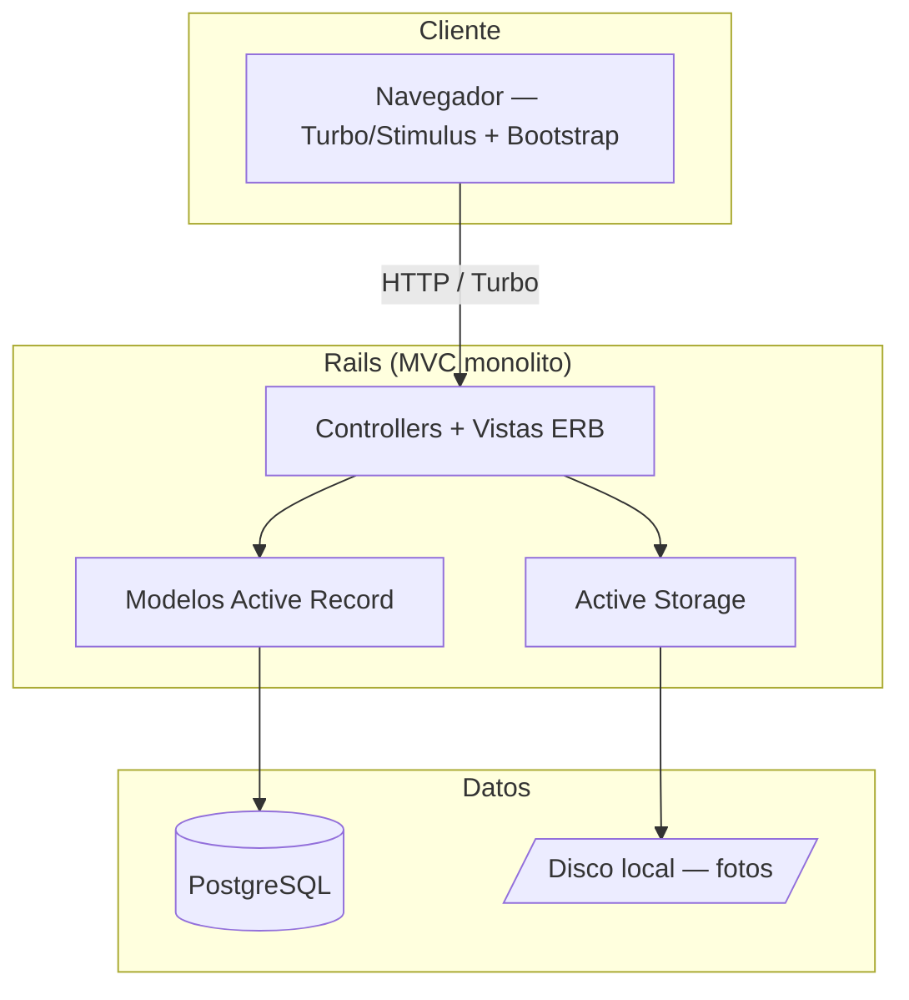
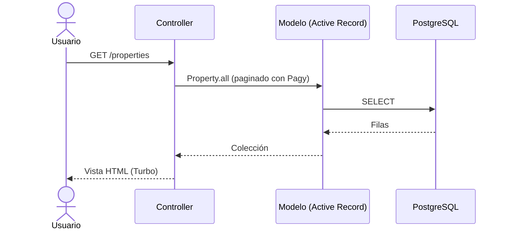

# InforcapHouse — Arquitectura

> Vista de alto nivel de cómo está construido el sistema y cómo se reparten las
> responsabilidades. Para el stack real (versiones, librerías) ver
> [`stack.md`](stack.md). Para el negocio ver
> [`../product/business-model.md`](../product/business-model.md).
>
> **Última actualización**: 2026-07-02

## Diagrama

## Componentes

| Componente        | Responsabilidad                                              | Tecnología          |
| ----------------- | ----------------------------------------------------------- | ------------------- |
| Páginas estáticas | Home y términos legales (`PagesController`)                  | Rails + ERB         |
| Autenticación     | Registro, login y recuperación de usuarios                  | Devise              |
| Inmuebles         | CRUD de propiedades con tipos, oferta, features y fotos      | Scaffold Rails      |
| Contacto          | Formulario público de contacto (`ContactsController`)        | Rails               |
| Multimedia        | Fotos de inmuebles vía adjuntos polimórficos                | Active Storage      |
| Paginación        | Listado paginado de inmuebles                                | Pagy                |

## Decisiones clave

| Decisión                                | Razón                                                          |
| --------------------------------------- | -------------------------------------------------------------- |
| Monolito MVC de Rails (server-rendered) | Máxima velocidad de entrega para un MVP de 4 horas de prototipo|
| Devise para autenticación               | Evita implementar sesión/registro/recuperación a mano          |
| Roles con `enum` en `User`              | Dos roles (regular/admin) sin dependencias extra               |

> El detalle y las alternativas de cada decisión relevante se registran como
> ADRs en [`../decisions/`](../decisions/README.md).

## Reglas no negociables

- La autorización se valida siempre en el servidor; el rol `admin` es el único que gestiona inmuebles.
- Las validaciones de datos viven en los modelos Active Record (no confiar solo en el frontend).
- Un inmueble siempre pertenece a un usuario, un tipo de oferta y un tipo de inmueble (FK obligatorias).

## Flujos principales

## Referencias

- [`stack.md`](stack.md) — stack tecnológico y versiones.
- [`database.md`](database.md) — modelo de datos.
- [`auth.md`](auth.md) — autenticación y autorización.
- [`api.md`](api.md) — contrato de API.
- [`../conventions/`](../conventions/README.md) — convenciones de trabajo.
