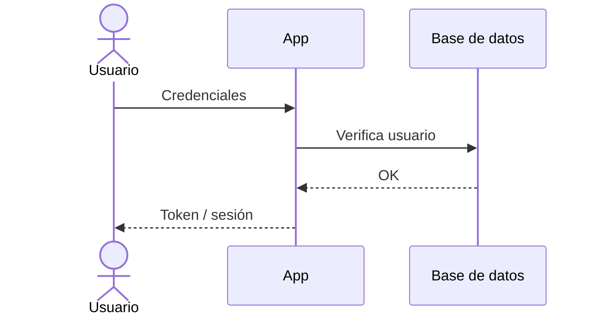

# Autenticación y Autorización

> Cómo se autentican y autorizan los usuarios en **InforcapHouse**.
> Para las reglas transversales ver [`../conventions/authentication.md`](../conventions/authentication.md).
>
> **Última actualización**: 2026-07-02

## Visión general

- **Método de autenticación**: sesión basada en cookies, gestionada por **Devise** 4.9.
- **Almacenamiento de credenciales**: tabla `users`, campo `encrypted_password`.
- **Hashing de contraseñas**: bcrypt (default de Devise).
- **Módulos activos**: `database_authenticatable`, `registerable`, `recoverable`, `rememberable`, `validatable`.

## Modelo de identidad

| Concepto       | Descripción                                                                    |
| -------------- | ------------------------------------------------------------------------------ |
| Usuario        | Modelo `User` (email, name, phone, role); valida presencia de `name` y `phone` |
| Sesión         | Cookie de sesión de Rails/Devise; "recordarme" vía `rememberable`              |
| Roles          | `enum role: [:regular, :admin]` — `regular` (default) y `admin`               |

## Flujo de registro / login

## Gestión de sesiones / tokens

- **Expiración**: sesión de cookie estándar de Rails; `rememberable` extiende la sesión ("recordarme").
- **Renovación**: no aplica (no hay JWT/refresh tokens).
- **Revocación**: logout vía `DELETE /logout` (Devise) destruye la sesión.
- **Rutas** (`config/routes.rb`): `path: ''`, con `sign_in: 'login'`, `sign_out: 'logout'`, `sign_up: 'register'`.

## Autorización

- **Modelo**: control por rol (`enum` en `User`), validado en el servidor.
- **Dónde se valida**: siempre en el servidor, en cada request.
- **Roles y permisos**:

| Rol       | Permisos                                                        |
| --------- | -------------------------------------------------------------- |
| `regular` | Navegar el catálogo, ver inmuebles, enviar formulario de contacto |
| `admin`   | Todo lo anterior + gestionar (crear/editar/eliminar) inmuebles    |

## Proveedores externos (OAuth / SSO)

- No aplica — no se usa OAuth/SSO en el MVP.

## Recuperación de cuenta

- Reset de contraseña vía el módulo `recoverable` de Devise (token `reset_password_token`).

## Consideraciones de seguridad

Ver [SECURITY.md](../../SECURITY.md) para la política completa.
